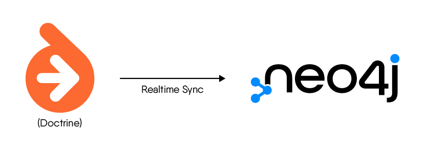

# Syndesi's Neo4jSyncBundle



This bundle provides real time synchronization capabilities between Doctrine's EntityManager and a Neo4j database.

Links:

- [Documentation](https://syndesi.github.io/neo4j-sync-bundle)
- [Laudi's Neo4j Client](https://github.com/neo4j-php/neo4j-php-client) (no affiliation, but is a core dependency of
  this library)

## Development

```bash
# yml linter, empty result if no errors are found
docker run --rm -it -v $(pwd):/data cytopia/yamllint .
# markdown linter
docker run --rm -v $(pwd):/work tmknom/markdownlint '**/*.md' --ignore vendor
```
